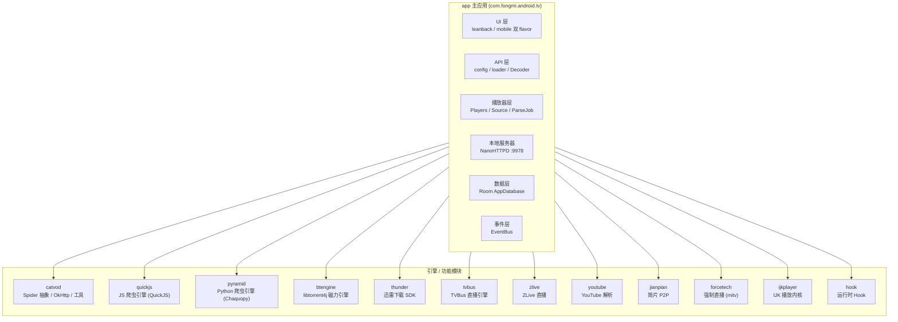
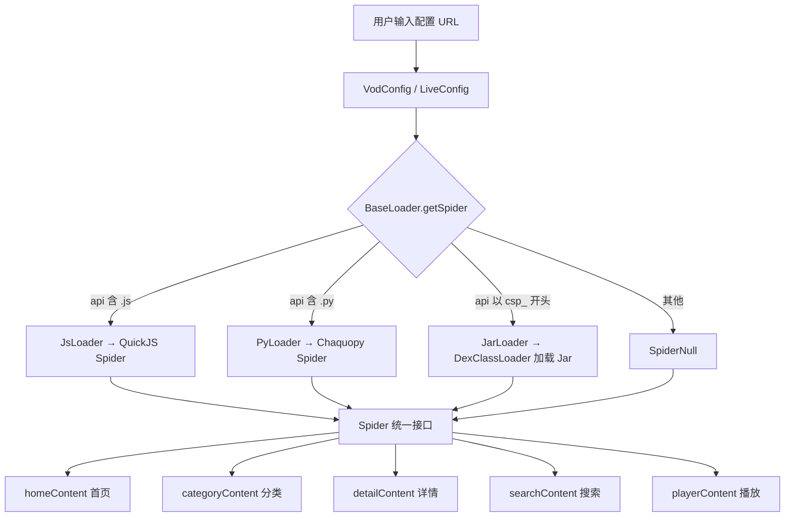
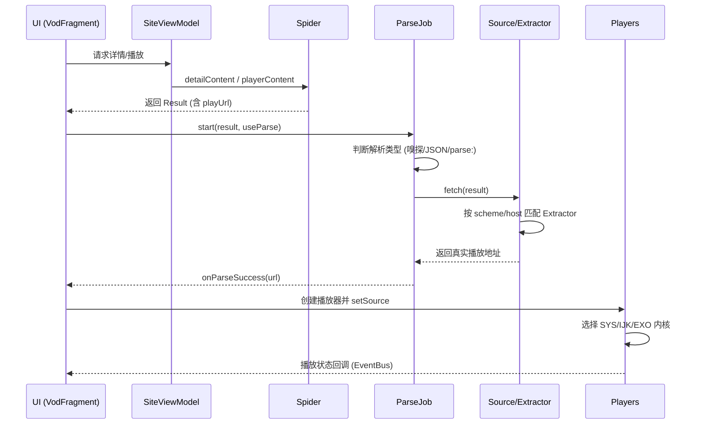
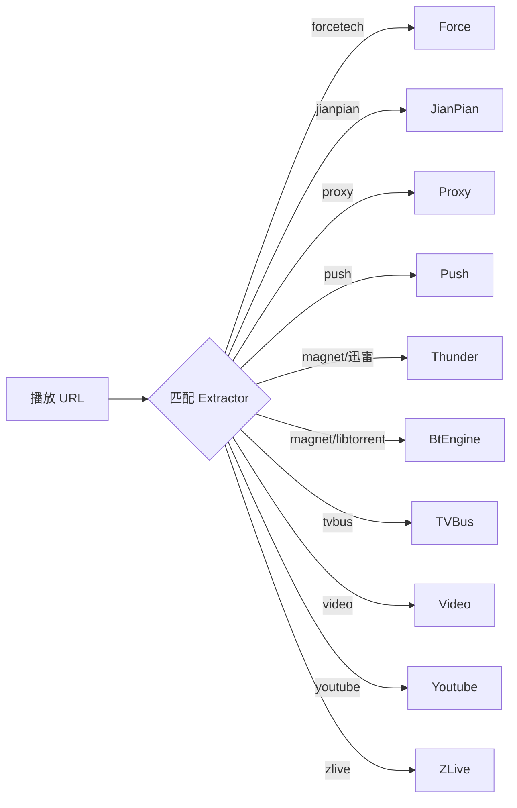
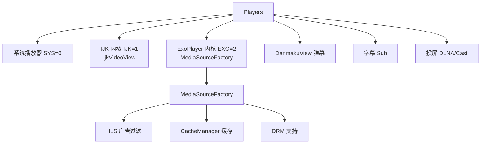
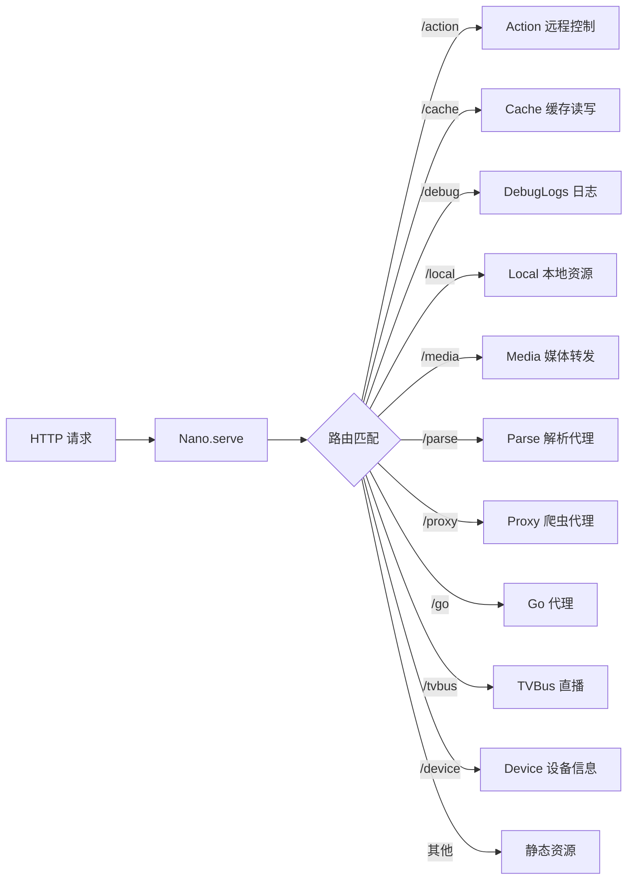
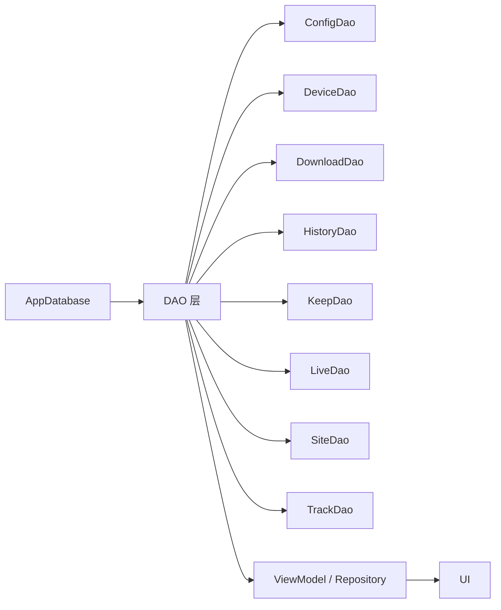
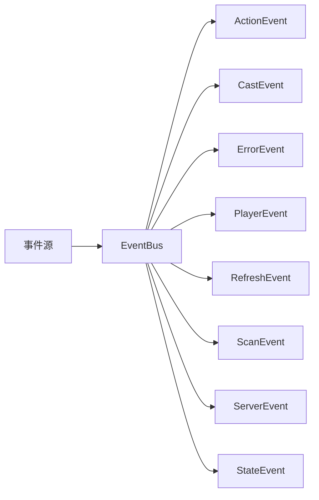
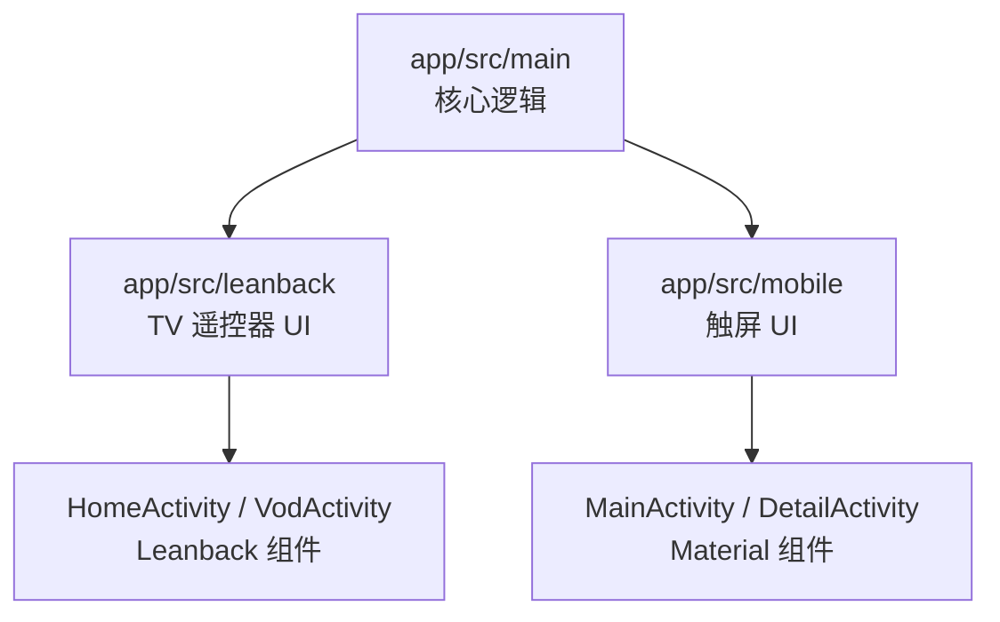
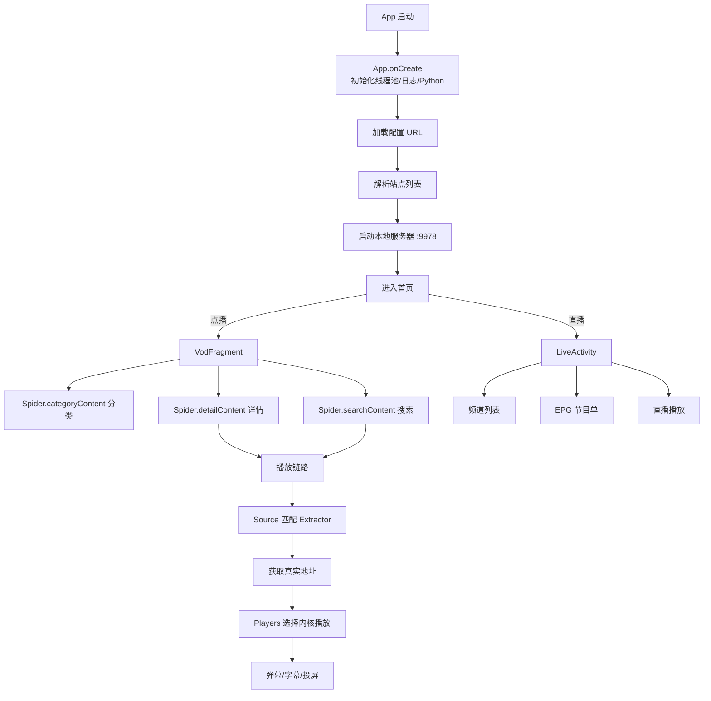

# 影视 (FongMi TV) 架构级介绍

> 本文档从架构层面剖析本项目（基于 CatVod 的影视点播/直播聚合应用），涵盖整体框架、模块划分、核心运行机制与数据流，并以 Mermaid 图直观呈现。

---

## 1. 项目定位

本项目是一个 **Android 端影视聚合播放器**，核心能力：

- **点播（VOD）**：聚合多个站点，通过爬虫（Jar / JS / Python）抓取分类、详情、搜索、播放地址。
- **直播（Live）**：聚合直播源，支持 EPG 节目单、回看、台标、免密等。
- **多播放内核**：系统播放器 / IJK / ExoPlayer 三选一，支持软硬解、弹幕、字幕、倍速、投屏（DLNA/Cast）。
- **多解析引擎**：嗅探、JSON 解析、磁力（迅雷 / libtorrent）、TVBus、Youtube、ZLive、简片 P2P、强制（forcetech）等。
- **本地 HTTP 服务**：内置 NanoHTTPD 服务器（默认端口 9978），提供代理、缓存、媒体转发、远程控制 API。

---

## 2. 顶层模块架构

项目采用 **Gradle 多模块** 结构，`app` 为主应用，其余为功能/引擎模块。

### 2.1 模块职责一览

| 模块 | 职责 | 关键类 |
|------|------|--------|
| `app` | 主应用：UI、配置、播放、服务器、数据库 | [`App.java`](app/src/main/java/com/fongmi/android/tv/App.java) |
| `catvod` | 爬虫抽象基类、网络层（OkHttp）、通用工具 | [`Spider.java`](catvod/src/main/java/com/github/catvod/crawler/Spider.java) |
| `quickjs` | 以 QuickJS 运行 JS 爬虫脚本 | [`Spider.java`](quickjs/src/main/java/com/fongmi/quickjs/crawler/Spider.java) |
| `pyramid` | 以 Chaquopy 运行 Python 爬虫 | [`app.py`](pyramid/src/main/python/app.py) |
| `btengine` | libtorrent4j 原生磁力引擎（进程内） | [`LibtorrentEngine.java`](btengine/src/main/java/com/fongmi/btengine/LibtorrentEngine.java) |
| `thunder` | 迅雷下载 SDK（边下边播） | [`XLTaskHelper.java`](thunder/src/main/java/com/xunlei/downloadlib/XLTaskHelper.java) |
| `tvbus` / `zlive` | 直播引擎 | — |
| `youtube` / `jianpian` / `forcetech` | 特定源解析 | — |
| `ijkplayer` | IJK 播放内核（含 ffmpeg so） | — |
| `hook` | 运行时 Hook（如 TVBus 鉴权） | [`Hook.java`](hook/src/main/java/com/fongmi/hook/Hook.java) |

---

## 3. 核心运行机制

### 3.1 配置加载与爬虫分发

应用通过 **配置 URL** 拉取站点列表（点播/直播），并按 API 类型分发到不同的爬虫加载器。

- [`BaseLoader.java`](app/src/main/java/com/fongmi/android/tv/api/loader/BaseLoader.java) 是爬虫分发的门面，内部持有 `JarLoader` / `PyLoader` / `JsLoader` 三个加载器。
- 所有爬虫最终都实现 [`Spider.java`](catvod/src/main/java/com/github/catvod/crawler/Spider.java) 抽象类，向上层提供统一方法（首页、分类、详情、搜索、播放、代理）。
- Jar 爬虫通过 `DexClassLoader` 动态加载远程 Jar，并反射调用 `com.github.catvod.spider.Init` 初始化。

### 3.2 播放链路（点播）

播放是核心链路，涉及 **源解析（Source/Extractor）→ 解析任务（ParseJob）→ 播放内核（Players）**。

#### 源解析器（Extractor）链

[`Source.java`](app/src/main/java/com/fongmi/android/tv/player/Source.java) 维护一组 `Extractor`，按 URL 的 scheme/host 匹配：

> 磁力播放采用 **双引擎互为备选**：优先迅雷 SDK（本地 HTTP 代理 Range 206 实现边下边播），失败则回退到 libtorrent4j 开源引擎。

### 3.3 播放内核（Players）

[`Players.java`](app/src/main/java/com/fongmi/android/tv/player/Players.java) 是播放器门面，封装三种内核：

- 支持软解/硬解（`SOFT/HARD`）、倍速、重连、自动续播。
- 通过 `MediaSessionCompat` 与系统媒体会话集成。
- 弹幕使用 `DanmakuView`，字幕支持本地/远程。

### 3.4 本地 HTTP 服务器

[`Server.java`](app/src/main/java/com/fongmi/android/tv/server/Server.java) 启动 NanoHTTPD（默认 9978，冲突自动递增），提供多类处理：

- 服务器承担 **爬虫代理**（`/proxy`，供 JS/Python 脚本回源）、**媒体转发**（`/media`，磁力引擎产出的本地流）、**远程控制 API**（`/action`，如刷新详情/播放/直播、推送字幕/弹幕）。

### 3.5 数据层

使用 **Room** 持久化，实体包括：`Keep`（收藏）、`Site`（站点）、`Live`（直播）、`Track`（音轨）、`Config`（配置）、`Device`（设备）、`History`（历史）、`Download`（下载）。

### 3.6 事件驱动

应用大量使用 **EventBus** 解耦模块间通信：

---

## 4. 双 UI 风格（flavor）

`app` 通过 Gradle flavor 区分 **TV 端（leanback）** 与 **手机端（mobile）**，共享 `main` 下的核心逻辑：

- **leanback**：面向遥控器，使用 `CustomVerticalGridView`、`CustomHorizontalGridView`、Presenter 体系。
- **mobile**：面向触屏，使用 RecyclerView + Fragment + 底部导航。

---

## 5. 端到端运行流程总览

---

## 6. 关键设计要点

1. **单例门面**：`App`、`VodConfig`、`LiveConfig`、`BaseLoader`、`Source`、`Server` 均为单例，通过静态 `get()` 访问，全局共享状态。
2. **线程模型**：`App` 提供固定线程池（`App.execute`）与主线程 Handler（`App.post`），耗时任务（配置加载、爬虫抓取、解析）统一在后台执行，结果通过回调/EventBus 回主线程。
3. **可插拔引擎**：Extractor 接口 + 加载器分发，使新增源/引擎只需实现接口并注册，无需改动上层。
4. **本地服务器中枢**：NanoHTTPD 承担代理、媒体转发与远程控制，是连接爬虫、磁力引擎与播放器的枢纽。
5. **多语言爬虫**：统一 `Spider` 抽象，屏蔽 Jar/JS/Python 三种实现差异，上层无感知。

---

## 7. 目录速查

| 路径 | 说明 |
|------|------|
| [`app/src/main/java/com/fongmi/android/tv/api`](app/src/main/java/com/fongmi/android/tv/api) | 配置加载与爬虫分发 |
| [`app/src/main/java/com/fongmi/android/tv/player`](app/src/main/java/com/fongmi/android/tv/player) | 播放器、源解析、解析任务 |
| [`app/src/main/java/com/fongmi/android/tv/server`](app/src/main/java/com/fongmi/android/tv/server) | 本地 HTTP 服务器 |
| [`app/src/main/java/com/fongmi/android/tv/db`](app/src/main/java/com/fongmi/android/tv/db) | Room 数据库 |
| [`app/src/main/java/com/fongmi/android/tv/bean`](app/src/main/java/com/fongmi/android/tv/bean) | 数据模型 |
| [`app/src/main/java/com/fongmi/android/tv/event`](app/src/main/java/com/fongmi/android/tv/event) | EventBus 事件 |
| [`catvod`](catvod) | 爬虫抽象与网络层 |
| [`quickjs`](quickjs) | JS 爬虫引擎 |
| [`pyramid`](pyramid) | Python 爬虫引擎 |
| [`btengine`](btengine) / [`thunder`](thunder) | 磁力引擎 |
